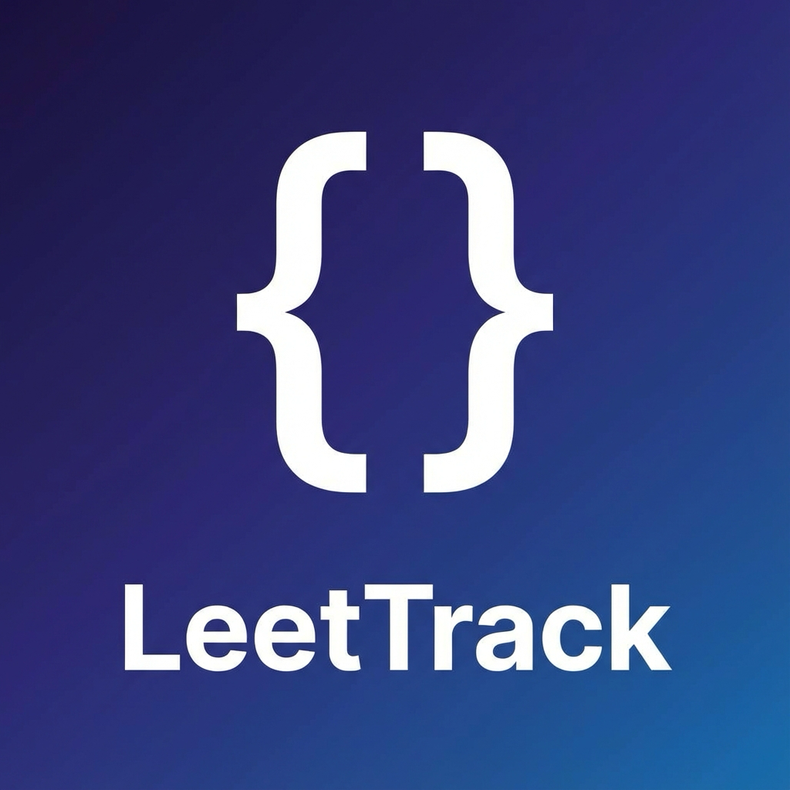

# LeetTrack

**LeetTrack** is a beautiful, private, and offline-first desktop application for tracking your LeetCode problem-solving journey. Built with **Tauri** and **Next.js**, it combines the performance of a native app with the modern UI of the web.



## ✨ Features

*   **🚀 Instant Auto-Fill**: Type a problem title (e.g., "Two Sum") or number, and LeetTrack instantly populates the Number, Difficulty, Tags, and URL using its offline database of **3,792+ problems**.
*   **💾 File System Persistence**: Your data is saved securely to a local JSON file on your machine (`leettrack-data.json`). Your progress survives app updates, uninstalls, and can be easily backed up.
*   **⚡ Native Performance**: Built on Rust (Tauri), the app is blazingly fast and lightweight (~10MB installer) compared to Electron apps.
*   **🎨 Beautiful UI**: Crafted with `shadcn/ui` and Tailwind CSS, featuring a clean Indigo theme, dark mode support, and a responsive layout.
*   **📝 Rich Editor**:
    *   **Live Syntax Highlighting**: Python code editor with VS Code-like experience (line numbers, folding, One Dark theme).
    *   **Smart Tagging**: Auto-complete tags and one-click presets for common topics (DP, Graphs, Arrays).
    *   **Inline Management**: Edit, delete, and organize problems without leaving the flow.

## 🛠️ Tech Stack

*   **Frontend**: [Next.js](https://nextjs.org/) (React), [Tailwind CSS](https://tailwindcss.com/)
*   **UI Components**: [shadcn/ui](https://ui.shadcn.com/), [Lucide Icons](https://lucide.dev/)
*   **Backend / Native**: [Tauri v2](https://tauri.app/) (Rust)
*   **Editor**: [CodeMirror](https://uiwjs.github.io/react-codemirror/)
*   **State**: Local persistence via Tauri File System Plugin

## 📦 Installation

### Development
1.  **Prerequisites**: ensuring you have `pnpm` and [Rust](https://www.rust-lang.org/tools/install) installed.
2.  **Install Dependencies**:
    ```bash
    pnpm install
    ```
3.  **Run Locally**:
    ```bash
    pnpm tauri:dev
    ```

### Build for Production
To create a native application bundle (e.g., `.dmg` for macOS):

```bash
pnpm tauri:build
```

The output will be found in `src-tauri/target/release/bundle/`.

## 📂 Project Structure

*   `app/`: Next.js app router pages and logic.
*   `components/`: React UI components (ProblemEditor, ProblemList).
*   `lib/`: Core logic (Storage adapter, LeetCode data search).
*   `src-tauri/`: Rust backend configuration and capabilities.
*   `public/problems.json`: Offline database of LeetCode questions.

## 📄 License

MIT © [Danny Fisher](https://github.com/DannyFisher1)
